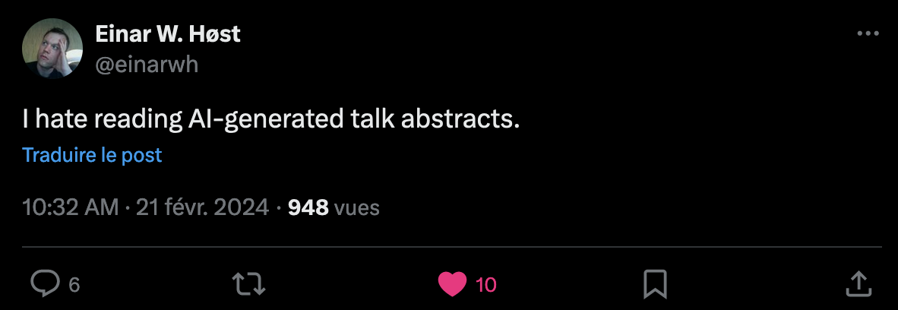

# genAICFP

### **SO DO I!**

I was so fed up reading the same abstract again and again that I asked this to chatgpt:  

> Could you write a short abstract that would describe a conference talk that speaks about how to use GenAI to generate the perfect abstract to submit to a conference call for paper. The abstract would insist on how the talk would unravel the use of GenAI as it's a trending thing in our industry.

I couldn't be happier with the answer :) 

## Title
Unleashing the Power of GenAI: Crafting the Perfect Conference Abstract

## Abstract
In today's rapidly evolving technological landscape, the integration of artificial intelligence (AI) into various domains has become a pivotal aspect of innovation and progress. This talk delves into the realm of academic conferences, where the submission of compelling abstracts plays a crucial role in disseminating groundbreaking research and fostering intellectual discourse. Emphasizing the emerging trend of GenAI, this presentation explores the transformative potential of harnessing AI algorithms to generate impeccably crafted abstracts for conference paper submissions.  

Attendees will embark on a journey through the intricacies of leveraging GenAI to streamline the abstract writing process, unlocking unparalleled efficiency and precision. We will unveil the underlying mechanisms of GenAI algorithms, elucidating how they analyze vast datasets and synthesize coherent narratives tailored to the unique requirements of conference themes and audiences.  

Moreover, this talk will elucidate practical strategies for optimizing GenAI-generated abstracts, ensuring they captivate the attention of reviewers and resonate with the academic community. By embracing GenAI as a cutting-edge tool in scholarly communication, researchers can elevate the quality of their submissions while maximizing the impact of their work on the global stage.  

Join us as we unravel the boundless possibilities of GenAI and redefine the art of crafting the perfect conference abstract in today's dynamic and competitive academic landscape.